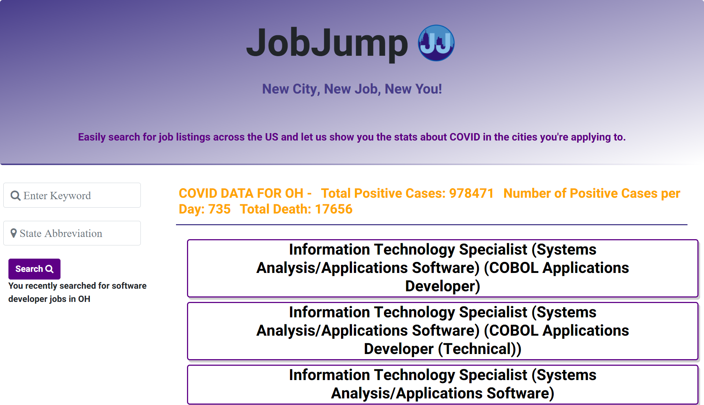

# job-jump

The year 2020 has changed the world indefinitely. The big theme was COVID-19 and it has affected every aspect of life as we know it. In the midst of the pandemic, nearly 16 million people moved, with most of them escaping big cities and moving to the suburbs and smaller towns. With these moves, many people were seeking new jobs. 

Moving to a new city is never easy, but a pandemic can make the process even more difficult. People want to get facts about covid easily, so that they can travel as safely as possible. With JobJump, we want to provide a space where you can find the most up to date facts about Covid-19 while you search for a job in a new city. 

JobJump allows users to search for job keywords in any US State and returns a job description, as well as COVID positive cases, deaths, and the number of increased covid cases per day. This information eases the pain of the job search, and allows you to make the best decision on what is safest for you and your family. We want you to make JobJump one of your go-to resources as you plan your life in a new city.   

## Table of Contents

- [Installation](#installation)
- [Usage](#usage)
- [Support](#support)
- [Contributing](#contributing)

## Installation

View our project at https://mschall217.github.io/job-jump/.

## Screenshot 

## Usage
    AS A person looking for a new job
    I WANT to enter a keyword and a state abbreviation
	THEN I see covid information for the state and job listings
		

## Support

Please [open an issue](https://github.com/mschall217/job-jump/issues) for support.

## Contributing

This was truly a team effort along with a lot of googling 

